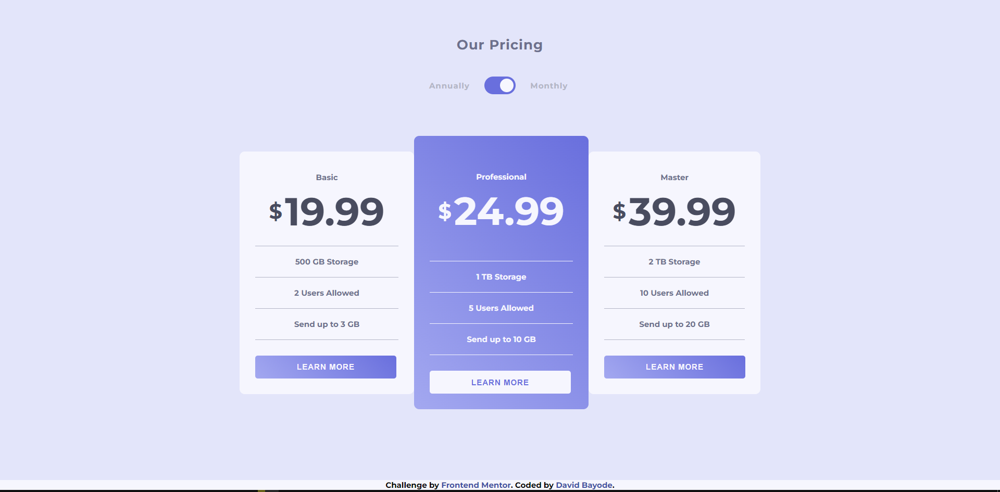

# Frontend Mentor - Pricing component with toggle solution

This is a solution to the [Pricing component with toggle challenge on Frontend Mentor](https://www.frontendmentor.io/challenges/pricing-component-with-toggle-8vPwRMIC). Frontend Mentor challenges help you improve your coding skills by building realistic projects. 

## Table of contents

- [Overview](#overview)
  - [The challenge](#the-challenge)
  - [Screenshot](#screenshot)
  - [Links](#links)
- [My process](#my-process)
  - [Built with](#built-with)
  - [What I learned](#what-i-learned)
  - [Continued development](#continued-development)
  - [Useful resources](#useful-resources)
- [Author](#author)
- [Acknowledgments](#acknowledgments)

## Overview

This challenge was very rewarding. I expanded on a lot of things I learnt before-hand and even incorportated new tools to finish the design and match it neatly.

### The challenge

Users should be able to:

- View the optimal layout for the component depending on their device's screen size
- Control the toggle with both their mouse/trackpad and their keyboard
- **Bonus**: Complete the challenge with just HTML and CSS

### Screenshot

### Links

- Solution URL: [GitHub Code](https://your-solution-url.com)
- Live Site URL: [Live link](https://your-live-site-url.com)

## My process

I took the mobile-first approach to solving the problem, I combined flex-box and grid to complete the overall layout and used a bit of javascript for the toggle functionality.

### Built with

- Semantic HTML5 markup
- CSS custom properties
- Flexbox
- CSS Grid
- Mobile-first workflow

### What I learned

I learnt and applied the use of NODE_LIST DOM elements and iterated the list to apply different display modes on the card prices.

### Continued development

There is always something to improve, maybe adding a theme-changer built into the design would be a great addition.

### Useful resources

- [StackOverflow](https://stackoverflow.com/questions/71243168/how-to-change-content-with-toggle-button-with-html-css-and-js) - StackOverflow was of big help in implementing the toggle functionality as they led me in the right direction.

## Author

- Website - [My Hashnode](https://davidbay.hashnode.dev)
- Frontend Mentor - [@David4bay](https://www.frontendmentor.io/profile/David4bay)
- Twitter - [@Davidbay01](https://www.twitter.com/Davidbay01)

## Acknowledgments

StackOverflow came to the rescue when I was finding it different to design the toggle component, saved me an extra day of troubleshooting.
